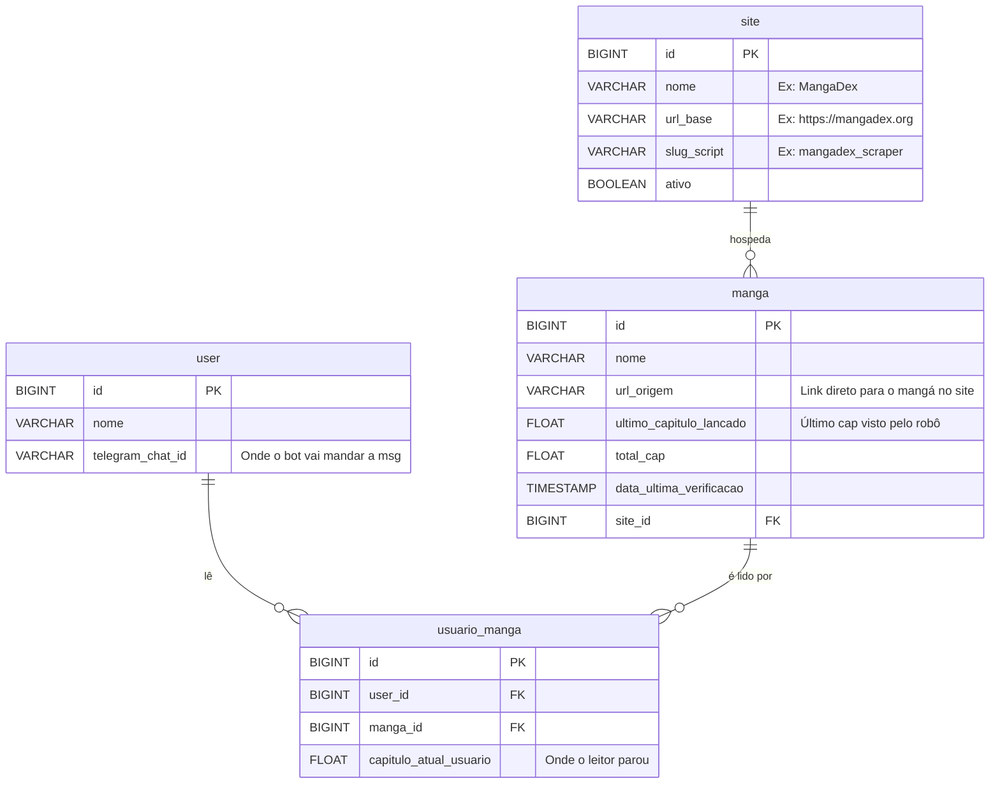

# Diagrama ER

```mermaid
erDiagram
    site ||--o{ manga : "hospeda"
    user ||--o{ usuario_manga : "lê"
    manga ||--o{ usuario_manga : "é lido por"

    site {
        BIGINT id PK
        VARCHAR nome "Ex: MangaDex"
        VARCHAR url_base "Ex: https://mangadex.org"
        VARCHAR slug_script "Ex: mangadex_scraper"
        BOOLEAN ativo
    }
    manga {
        BIGINT id PK
        VARCHAR nome
        VARCHAR url_origem "Link direto para o mangá no site"
        FLOAT ultimo_capitulo_lancado "Último cap visto pelo robô"
        FLOAT total_cap
        TIMESTAMP data_ultima_verificacao
        BIGINT site_id FK
    }
    user {
        BIGINT id PK
        VARCHAR nome
        VARCHAR telegram_chat_id "Onde o bot vai mandar a msg"
    }
    usuario_manga {
        BIGINT id PK
        BIGINT user_id FK
        BIGINT manga_id FK
        FLOAT capitulo_atual_usuario "Onde o leitor parou"
    }
```
